---
## Front matter
title: "РОССИЙСКИЙ УНИВЕРСИТЕТ ДРУЖБЫ НАРОДОВ ФАКУЛЬТЕТ ФИЗИКОМАТЕМАТИЧЕСКИХ И ЕСТЕСТВЕННЫХ НАУК"
subtitle: "Отчёт по лабораторной работе №2"
author: "Приспешкин Андрей Андреевич НКАбд-05-23"

## Generic otions
lang: ru-RU
toc-title: "Содержание"

## Bibliography
bibliography: bib/cite.bib
csl: pandoc/csl/gost-r-7-0-5-2008-numeric.csl

## Pdf output format
toc: true # Table of contents
toc-depth: 2
lof: true # List of figures
lot: true # List of tables
fontsize: 12pt
linestretch: 1.5
papersize: a4
documentclass: scrreprt
## I18n polyglossia
polyglossia-lang:
  name: russian
  options:
	- spelling=modern
	- babelshorthands=true
polyglossia-otherlangs:
  name: english
## I18n babel
babel-lang: russian
babel-otherlangs: english
## Fonts
mainfont: PT Serif
romanfont: PT Serif
sansfont: PT Sans
monofont: PT Mono
mainfontoptions: Ligatures=TeX
romanfontoptions: Ligatures=TeX
sansfontoptions: Ligatures=TeX,Scale=MatchLowercase
monofontoptions: Scale=MatchLowercase,Scale=0.9
## Biblatex
biblatex: true
biblio-style: "gost-numeric"
biblatexoptions:
  - parentracker=true
  - backend=biber
  - hyperref=auto
  - language=auto
  - autolang=other*
  - citestyle=gost-numeric
## Pandoc-crossref LaTeX customization
figureTitle: "Рис."
tableTitle: "Таблица"
listingTitle: "Листинг"
lofTitle: "Список иллюстраций"
lotTitle: "Список таблиц"
lolTitle: "Листинги"
## Misc options
indent: true
header-includes:
  - \usepackage{indentfirst}
  - \usepackage{float} # keep figures where there are in the text
  - \floatplacement{figure}{H} # keep figures where there are in the text
---

## Содержание

         - 1. Цель работы..................................................................
      - 2. Задание.........................................................................
      - 3. Выполнение лабораторной работы.....................................
   - 4. Выводы.........................................................................
- 5. Список литературы.........................................................

**1) Цель работы**

Целью работы является изучить применение средств для контроля версий, а
также приобрести практические навыки по работе с системой контроля версий
git.

**2) Задания**
1) Настройка GitHub.

2) Базовая настройка git.

3) Создание SHH-ключа.

4) Создание рабочего пространства.

5) Создание репозитория на основе шаблона.

6) Настройка каталога курса.

7) Задания для самостоятельной работы.

**3) Выполнение лабораторной работы**

**1)** Создадим учётную запись на GitHub (рис.1).

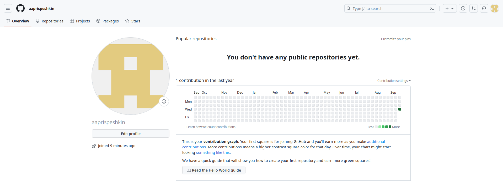

**2)** Откроем терминал и введём команду git config, указав имя фамилию и электронную почту пользователя (рис.2).

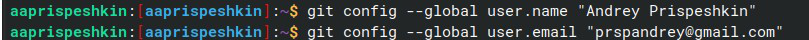

Продолжая использовать команду git config, настраиваем кодировку utf-8 для
вывода сообщений (рис.3) и создаём начальную ветку “master” (рис.4).

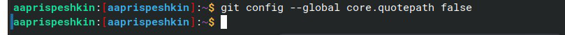

Зададим параметр autocrlf со значением input (рис.5).

Чтобы git мог определять преобразование на обратимость, зададим параметр autocrlf со значением warn(рис.6)

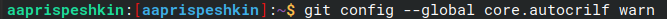

**3)** Для последующей работой с git и github, нам потребуется сгенерировать
уникальный ssh ключ. Сделать это можно командой ssh-keygen(рис.7).

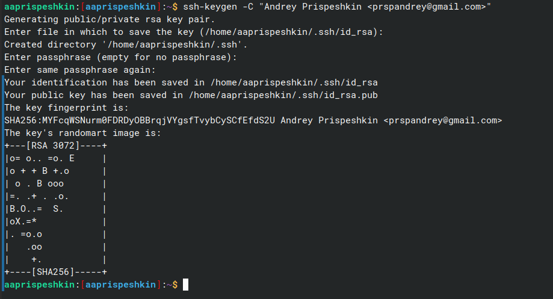

Скопируем ключ из директории в которой он был сохранён, используя команды
cat и xclip(рис.8)

Затем, загружаем скопированный ключ в GitHub. В настройках выберем пункт
“SSH and GPG keys”(рис.9), там выберем “Add new SSH key” и вставим
скопированный ранее ключ(рис.10).

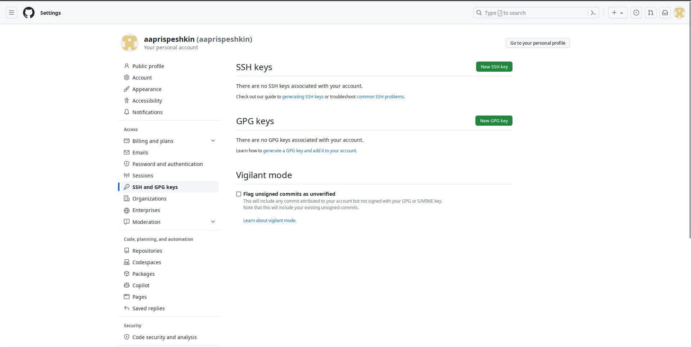

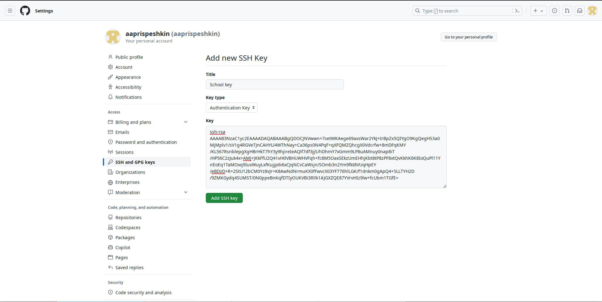

**4)** С помощью утилиты mkdir с ключом -р создадим рабочую директорию(рис.11).

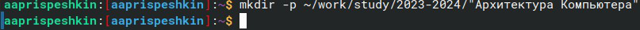

**5)** Перейдём на страницу с шаблоном курса
(“https://github.com/yamadharma/course-directory-student-template”) и скопируем
шаблон (рис.12, 13 и 14)

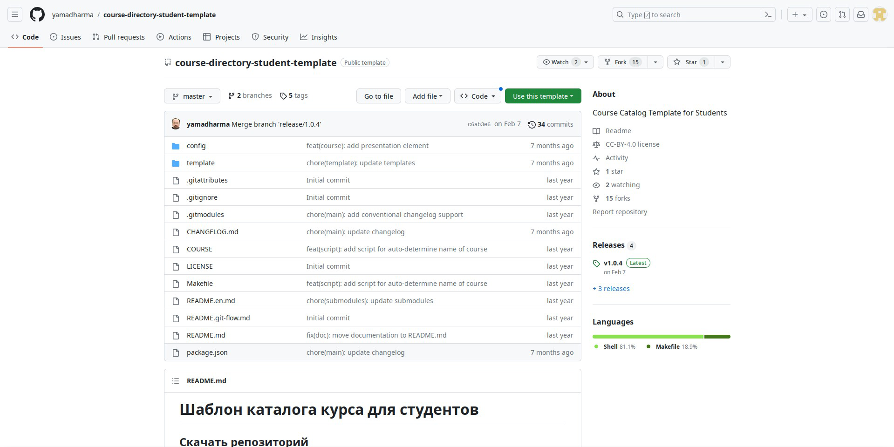

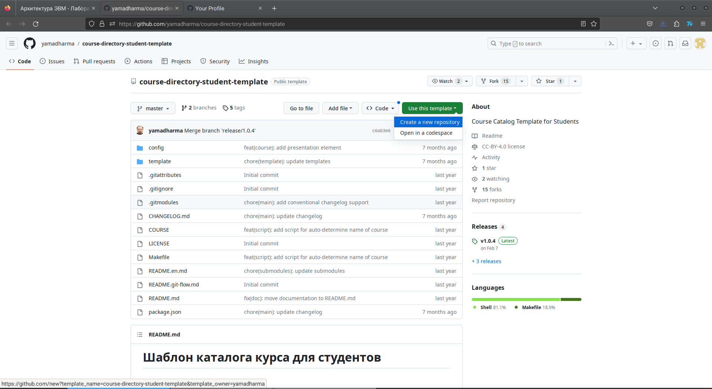

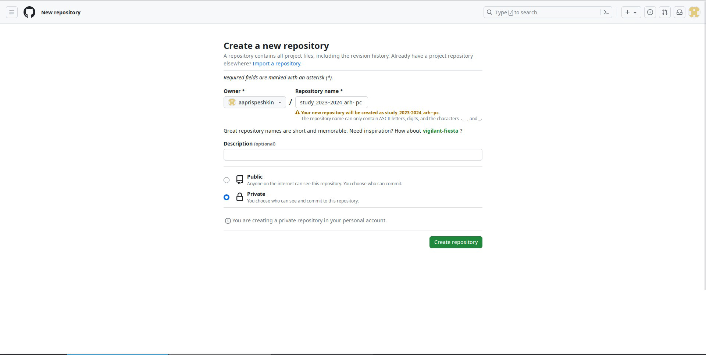

Пользуясь утилитой cd перейдём в каталог курса(рис.15).

Командой git clone с ключом –recursive и пользуясь ссылкой на github
клонируем созданный репозиторий(рис.16).

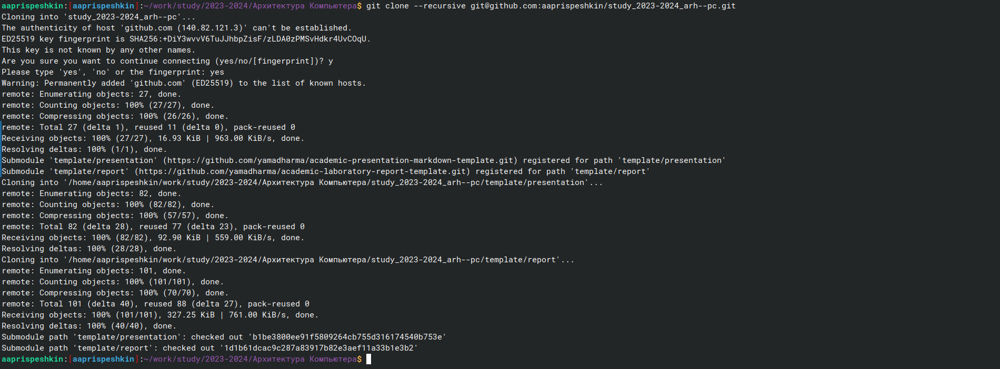

**6)** Утилитой rm удалим лишние файлы из каталога курса(рис.17).

Командами echo и make создадим необходимые каталоги(рис.18).

Командой git add добавим созданные каталоги на сервер, а командой git commit
сохраним сделанные изменения(рис.19).

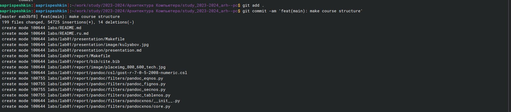

Командой git push отправим все сделанные изменения на сервер(рис.20).

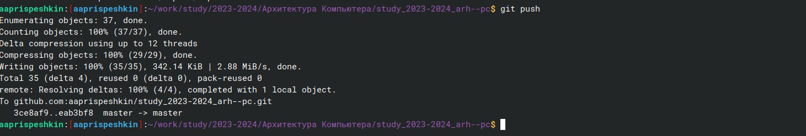

Проверим правильность сделанных изменений на github(рис.21).

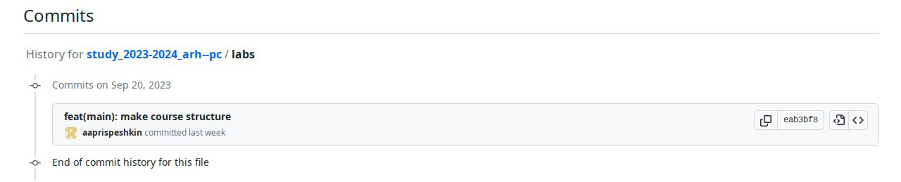

**7)** Перейдём в подкаталог lab02 и с помощью утилиты touch создадим файл
отчёта по лабораторной работе(рис.22).

Скопируем отчёт по первой лабораторной работе из каталога Documents в
каталог lab01/report и проверим правильность копирования утилитой ls(рис.23).

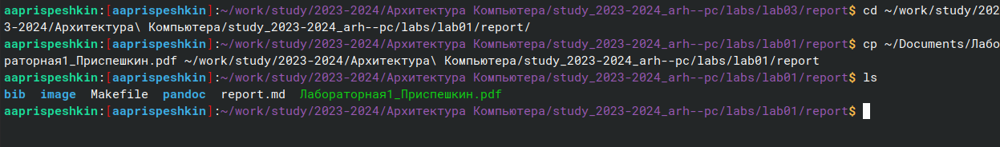

Командой git add добавим отчёт по первой лабораторной работе на сервер,
повторим эти действия с отчётом по второй лабораторной работе(рис.24, 25 и
26)

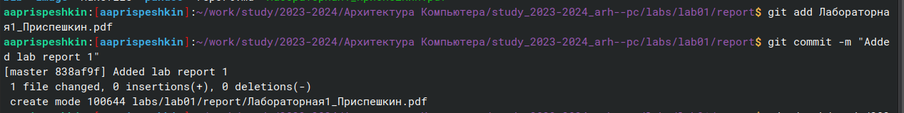

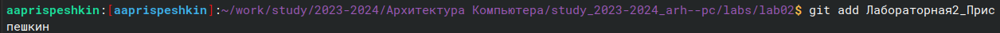

Командой git push отправим все созданные файлы в центральный
репозиторий(рис.27).

Проверим правильность введённых нами команд в GitHub(рис.28).

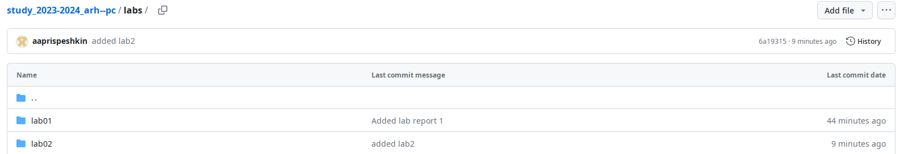

**4) Вывод**
В результате выполнения данной лабораторной работы я научился пользоваться
системой контроля версий git в терминале Linux, а также создавать и обновлять
репозитории в GitHub.

**5) Список литературы**

1. Лабораторная работа No2. Система контроля версий

Git

