---
## Front matter
title: "Лабораторная работа №4"
subtitle: "Создание и процесс обработки программ на языке ассемблера NASM"
author: "Приспешкин Андрей Андреевич"

## Generic otions
lang: ru-RU
toc-title: "Содержание"

## Bibliography
bibliography: bib/cite.bib
csl: pandoc/csl/gost-r-7-0-5-2008-numeric.csl

## Pdf output format
toc: true # Table of contents
toc-depth: 2
lof: true # List of figures
lot: true # List of tables
fontsize: 12pt
linestretch: 1.5
papersize: a4
documentclass: scrreprt
## I18n polyglossia
polyglossia-lang:
  name: russian
  options:
	- spelling=modern
	- babelshorthands=true
polyglossia-otherlangs:
  name: english
## I18n babel
babel-lang: russian
babel-otherlangs: english
## Fonts
mainfont: PT Serif
romanfont: PT Serif
sansfont: PT Sans
monofont: PT Mono
mainfontoptions: Ligatures=TeX
romanfontoptions: Ligatures=TeX
sansfontoptions: Ligatures=TeX,Scale=MatchLowercase
monofontoptions: Scale=MatchLowercase,Scale=0.9
## Biblatex
biblatex: true
biblio-style: "gost-numeric"
biblatexoptions:
  - parentracker=true
  - backend=biber
  - hyperref=auto
  - language=auto
  - autolang=other*
  - citestyle=gost-numeric
## Pandoc-crossref LaTeX customization
figureTitle: "Рис."
tableTitle: "Таблица"
listingTitle: "Листинг"
lofTitle: "Список иллюстраций"
lotTitle: "Список таблиц"
lolTitle: "Листинги"
## Misc options
indent: true
header-includes:
  - \usepackage{indentfirst}
  - \usepackage{float} # keep figures where there are in the text
  - \floatplacement{figure}{H} # keep figures where there are in the text
---

# Цель работы

Цель данной лабораторной работы -- базовая ознакомление с языком NASM, а также освоить процедуры компиляции и сборки программ написаных на этом языке.

# Задание

1. Создание программы Hello world на языке NASM
2. Работа с транслятором NASM
3. Работа с компоновщиком LD
4. Запуск исполняемого файла
5. Задания для самостоятельной работы

# Выполнение лабораторной работы

Создадим в рабочем каталоге work подкаталог в котором будет выполняться лабораторная работа(Рис.1).

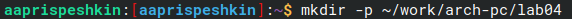

Перейдём в созданный нами подкаталог(Рис.2).

Создадим файл hello.asm утилитой touch(Рис.3).

Редактировать файл будем в текстовом редакторе neovim(Рис.4).

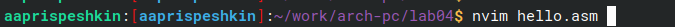

Вставим пример кода из лабораторной работы в текстовый редактор(Рис.5).

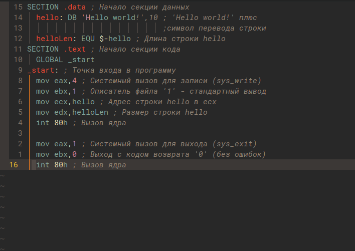

Переведём текст программы hello.asm в объектный код с помощью транслятора(Рис.6).

Введём команду которая скомпилирует файл hello.asm в файл obj.o, так же воспользуемся ключом -g и с помощью ключа -l создадим файл листинга list.lst(Рис.7).

Проверим правильность выполнения работы утилитой ls(Рис.8).

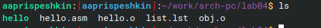

Передадим файл hello.o компоновщику ld, зададим имя создаваемого файла с помощью ключа -o(Рис.9).

Проверим правильность работы компоновщика утилитой ls(Рис. 10).

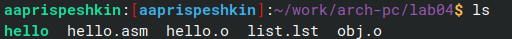

Передадим файл obj.o компоновщику. Файл будем иметь имя main, так как оно было указано после ключа -o(Рис.11).

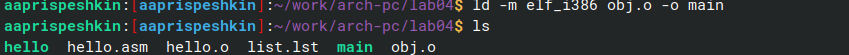

Запустим сделанную нами программу hello(Рис.12).

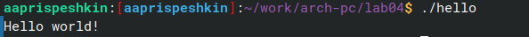

Утилитой cp создадим копию hello.asm и назовём её lab4.asm. Проверим правильность копирования утилитой ls(Рис.13).

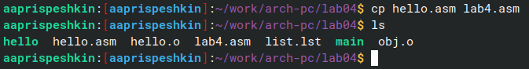

Откроем файл lab4.asm в текстовом редакторе neovim(Рис.14).

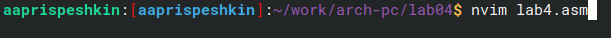

Внеёсем изменения в код так, чтобы программа lab4.asm выводила мои имя и фамилию(Рис.15).

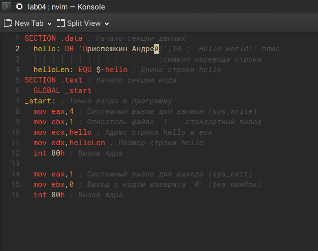

Скомпилируем получившийся код в объектный файл lab4.o(Рис.16).

Отправим объектный код компоновщику для создания файла lab(Рис.17).

Запустим для проверки программу lab(Рис.18).

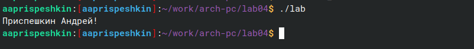

Скопируем программы созданные в ходе этой лабораторной работы в рабочий каталог(Рис.19).

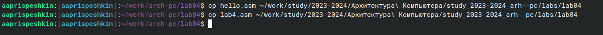

# Выводы

В ходе данной лабораторной работы я познакомился с языком NASM, а так же научился работать с компилятором и компоновщиком для превращения программ в объектный код и запускаемые файлы соответственно.

# Список литературы{.unnumbered}

[Лабораторная работа №4. Создание и процесс обработки программ на языке ассемблера NASM](https://esystem.rudn.ru/mod/resource/view.php?id=1030552)
