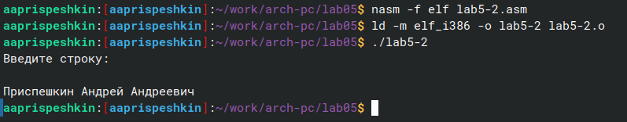
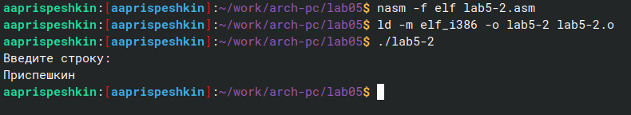

---
## Front matter
title: "Лабораторная работа №6"
subtitle: "Основы работы c Midnight Commander. Структура программ на языке ассемблера NASM. Системные вызовы в OC GNU Linux"
author: "Приспешкин Андрей Андреевич"

## Generic otions
lang: ru-RU
toc-title: "Содержание"

## Bibliography
bibliography: bib/cite.bib
csl: pandoc/csl/gost-r-7-0-5-2008-numeric.csl

## Pdf output format
toc: true # Table of contents
toc-depth: 2
lof: true # List of figures
lot: true # List of tables
fontsize: 12pt
linestretch: 1.5
papersize: a4
documentclass: scrreprt
## I18n polyglossia
polyglossia-lang:
  name: russian
  options:
	- spelling=modern
	- babelshorthands=true
polyglossia-otherlangs:
  name: english
## I18n babel
babel-lang: russian
babel-otherlangs: english
## Fonts
mainfont: PT Serif
romanfont: PT Serif
sansfont: PT Sans
monofont: PT Mono
mainfontoptions: Ligatures=TeX
romanfontoptions: Ligatures=TeX
sansfontoptions: Ligatures=TeX,Scale=MatchLowercase
monofontoptions: Scale=MatchLowercase,Scale=0.9
## Biblatex
biblatex: true
biblio-style: "gost-numeric"
biblatexoptions:
  - parentracker=true
  - backend=biber
  - hyperref=auto
  - language=auto
  - autolang=other*
  - citestyle=gost-numeric
## Pandoc-crossref LaTeX customization
figureTitle: "Рис."
tableTitle: "Таблица"
listingTitle: "Листинг"
lofTitle: "Список иллюстраций"
lotTitle: "Список таблиц"
lolTitle: "Листинги"
## Misc options
indent: true
header-includes:
  - \usepackage{indentfirst}
  - \usepackage{float} # keep figures where there are in the text
  - \floatplacement{figure}{H} # keep figures where there are in the text
---

# Цель работы

Целью данной лабораторной работы является приобретение навыков работы с программой Midnight Commander и освоение инструкций mov и int в языке ассемблера NASM.

# Задание

1. Основы работы в Midnight Commander
2. Структура программ на языке ассемблера NASM
3. Использование внешних файлов в языке ассемблера NASM
4. 

# Выполнение лабораторной работы

Откроем Midnight Commander через терминал командой mc(рис.1).

Перейдём в созданный нами в ходе лабораторной работы №4 каталог arch-pc(рис.2).

В Midnight Commander создадим новый каталог lab05(рис.3). 

Перейдём в созданный нами каталог(рис.4).

Утилитой touch создадим файл lab5-1.asm(рис.5).

Убедимся что файл действительно создан(рис.6).

Откроем файл lab5-1.asm во встроенный редакторе mcedit(рис.7).

Напишем код по образцу(рис.8).

В Midnight Commander откроем файл для просмотра и убедимся что правильно написали код(рис.9).

Оттранслируем и скомпонуем lab5-1.asm, затем запустим полученный файл для проверки его работоспособности(рис.10).

Скопируем файл lab5-1.asm в этот же каталог и назовём его lab5-2.asm(рис.11).

Убедимся в правильности копирования файла(рис.12).

По образцу напишем код, включим в него внешний файл in_out.asm и воспользуемся доступными нам подпрограммами(рис.13).

Оттранслируем, скомпонуем и запустим получившийся файл(рис.14).

Заменим в файле lab5-2.asm подпрограмму sprintLF на sprint(рис.15).

Проверим результат и заметим, что результат отличается. Это вызвано тем, что sprintLF переводит строку, а sprint нет(рис.16).

Скопируем файл lab5-1.asm и напишем там код для написания строки, запроса ввода от пользователя и вывода введёной строки на экран, без использования подпрограмм(рис.17).

Проверим его работоспособность(рис.18).

Скопируем файл lab5-2.asm и напишем там код для написания строки, запроса ввода от пользователя и вывода введёной строки на экран, в этот раз пользуясь подпрограммами из in_out.asm(рис.19)

Проверим работоспособность написанного нами кода(рис.20).

# Выводы

Я научился работать с программой Midnight Commander, а также освоил инструкции ассемблера mov и int и научился пользоваться внешними программами.

# Список литературы{.unnumbered}
[Лабораторная работа №6](https://esystem.rudn.ru/pluginfile.php/2089085/mod_resource/content/0/%D0%9B%D0%B0%D0%B1%D0%BE%D1%80%D0%B0%D1%82%D0%BE%D1%80%D0%BD%D0%B0%D1%8F%20%D1%80%D0%B0%D0%B1%D0%BE%D1%82%D0%B0%20%E2%84%965.%20%D0%9E%D1%81%D0%BD%D0%BE%D0%B2%D1%8B%20%D1%80%D0%B0%D0%B1%D0%BE%D1%82%D1%8B%20%D1%81%20Midnight%20Commander%20%28%29.%20%D0%A1%D1%82%D1%80%D1%83%D0%BA%D1%82%D1%83%D1%80%D0%B0%20%D0%BF%D1%80%D0%BE%D0%B3%D1%80%D0%B0%D0%BC%D0%BC%D1%8B%20%D0%BD%D0%B0%20%D1%8F%D0%B7%D1%8B%D0%BA%D0%B5%20%D0%B0%D1%81%D1%81%D0%B5%D0%BC%D0%B1%D0%BB%D0%B5%D1%80%D0%B0%20NASM.%20%D0%A1%D0%B8%D1%81%D1%82%D0%B5%D0%BC%D0%BD%D1%8B%D0%B5%20%D0%B2%D1%8B%D0%B7%D0%BE%D0%B2%D1%8B%20%D0%B2%20%D0%9E%D0%A1%20GNU%20Linux.pdf)
