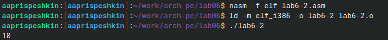
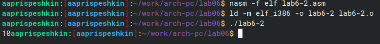
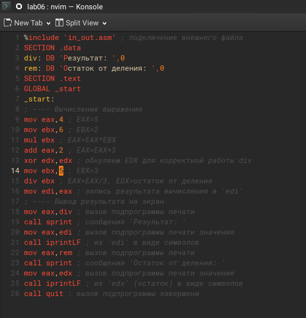

---
## Front matter
title: "Лабораторная работа №6"
subtitle: "Арифметические операции в NASM"
author: "Приспешкин Андрей Андреевич"

## Generic otions
lang: ru-RU
toc-title: "Содержание"

## Bibliography
bibliography: bib/cite.bib
csl: pandoc/csl/gost-r-7-0-5-2008-numeric.csl

## Pdf output format
toc: true # Table of contents
toc-depth: 2
lof: true # List of figures
lot: true # List of tables
fontsize: 12pt
linestretch: 1.5
papersize: a4
documentclass: scrreprt
## I18n polyglossia
polyglossia-lang:
  name: russian
  options:
	- spelling=modern
	- babelshorthands=true
polyglossia-otherlangs:
  name: english
## I18n babel
babel-lang: russian
babel-otherlangs: english
## Fonts
mainfont: PT Serif
romanfont: PT Serif
sansfont: PT Sans
monofont: PT Mono
mainfontoptions: Ligatures=TeX
romanfontoptions: Ligatures=TeX
sansfontoptions: Ligatures=TeX,Scale=MatchLowercase
monofontoptions: Scale=MatchLowercase,Scale=0.9
## Biblatex
biblatex: true
biblio-style: "gost-numeric"
biblatexoptions:
  - parentracker=true
  - backend=biber
  - hyperref=auto
  - language=auto
  - autolang=other*
  - citestyle=gost-numeric
## Pandoc-crossref LaTeX customization
figureTitle: "Рис."
tableTitle: "Таблица"
listingTitle: "Листинг"
lofTitle: "Список иллюстраций"
lotTitle: "Список таблиц"
lolTitle: "Листинги"
## Misc options
indent: true
header-includes:
  - \usepackage{indentfirst}
  - \usepackage{float} # keep figures where there are in the text
  - \floatplacement{figure}{H} # keep figures where there are in the text
---

# Цель работы

Цель данной лабораторной работы -- Освоение арифметических инструкций в языке ассемблера NASM 

# Задание

1. Численные и символьные данные в NASM
2. Выполнение арифметических операций
3. Задания для самостоятельной работы

# Выполнение лабораторной работы

Утилитой mkdir создадим каталог для выполнения лабораторной работы, утилитой touch создаём в этом каталоге файл lab6-1.asm, проверим утилитой ls(Рис.1).

В текстовом редакторе neovim вставим в файл код из листинга 6.1(Рис.2).

Создадим исполняемый файл lab6-1 и запустим его, заметим что вместо желаемого результата мы получаем символ j(Рис.3).

Поменяем в коде '6' и '4' на 6 и 4(Рис.4). 

Создадим исполняемый файл и запустим его, заметим что в этот раз мы получили символ переводa строки(Рис.5).

Утилитой touch создадим файл lab6-2.asm(Рис.6).

Вставим туда код из листинга 6.2(Рис.7).

Создадим исполняемый файл и проверим результат его работы, увидим что на экран выводится число 106(Рис.8).

!

Заменим символы '6' и '4' на числа 6 и 4(Рис.9).

Создадим исполняемый файл и проверим его работу. Увидим, что в результате мы получаем число 10(Рис.10).

Заменим функцию iprintLF на iprint(Рис.11).

Создадим исполняемый файл и посмотрим на результат. Увидим, что функция iprint не добавляет перенос строки после ответа вывода результата(Рис.12).

Утилитой touch создадим файл lab6-3.asm, проверим утилитой ls(Рис.13).

Вставим туда код из листинга 6.3, для вычесления выражения $/f(x) = (5 * 2 + 3)/3$ (Рис.14).

Создадим исполняемый файл и удостоверимся в правильности его работы(Рис.15).

Заменим в нашей программе числа, для вычесления выражения $/f(x) = (4 * 6 + 2)/5$ (Рис.16).

Проверим результат работы программы(Рис.17).

Утилитой touch создадим программу variant.asm(Рис.18).

Вставим в программу variant.asm код из листинга 6.4 для вычесления выражения (Sn mod 20) + 1, где Sn – номер студенческого билета (В данном случае a mod b – это остаток от деления a на b)(Рис.19).

Создадим исполняемый файл и введём туда номер своего студенческого билета, получим вариант 1(Рис.20)

# Ответы на вопросы

1. За вывод сообщения отвечают строки:
    mov eax, rem
    call sprint
2. mov ecx, x  - перевод адреса вводимой строки в регистр ecx
    mov edx, 80 - запись в регистр edx длины вводимой строки 
    call sread - вызов подпрограммы, отвечающей за ввод сообщения с клавиатуры
3. call atoi - вызов подпрограммы, для преобразования ascii символа в число
4. xor edx, edx
    mov ebx, 20 
    div ebx
    inc edx
5. edx
6. Увеличение значения в регистре еах на 1 
7. mov eax, edx
    call iprintLF

# Задания для самостоятельной работы

Создадим файл в котором будем работать, и напишем там код для вычисления выражения $/f(x) = (10 + 2x)/3$ (Рис.21).

Создадим исполняемый файл и проверим правильность написания кода со значениями х 1 и 10(Рис.22).

# Выводы

Я научился проводить арифметические операции на языке ассемблера NASM.

# Список литературы{.unnumbered}
[https://esystem.rudn.ru/pluginfile.php/2089086/mod_resource/content/0/%D0%9B%D0%B0%D0%B1%D0%BE%D1%80%D0%B0%D1%82%D0%BE%D1%80%D0%BD%D0%B0%D1%8F%20%D1%80%D0%B0%D0%B1%D0%BE%D1%82%D0%B0%20%E2%84%966.%20%D0%90%D1%80%D0%B8%D1%84%D0%BC%D0%B5%D1%82%D0%B8%D1%87%D0%B5%D1%81%D0%BA%D0%B8%D0%B5%20%D0%BE%D0%BF%D0%B5%D1%80%D0%B0%D1%86%D0%B8%D0%B8%20%D0%B2%20NASM..pdf] (Лабораторная работа №6)
