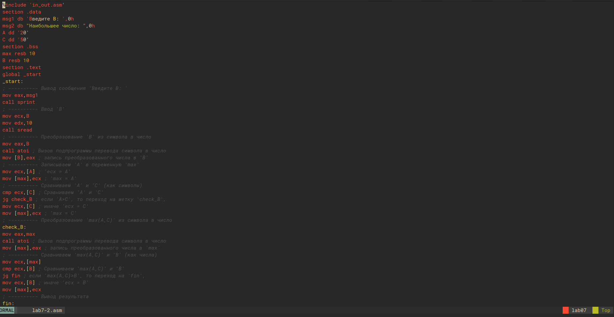

---
## Front matter
title: "Лабораторная работа №7"
subtitle: "Команды безусловного и условного переходов в Nasm. Программирование ветвлений."
author: "Приспешкин Андрей Андреевич"

## Generic otions
lang: ru-RU
toc-title: "Содержание"

## Bibliography
bibliography: bib/cite.bib
csl: pandoc/csl/gost-r-7-0-5-2008-numeric.csl

## Pdf output format
toc: true # Table of contents
toc-depth: 2
lof: true # List of figures
lot: true # List of tables
fontsize: 12pt
linestretch: 1.5
papersize: a4
documentclass: scrreprt
## I18n polyglossia
polyglossia-lang:
  name: russian
  options:
	- spelling=modern
	- babelshorthands=true
polyglossia-otherlangs:
  name: english
## I18n babel
babel-lang: russian
babel-otherlangs: english
## Fonts
mainfont: PT Serif
romanfont: PT Serif
sansfont: PT Sans
monofont: PT Mono
mainfontoptions: Ligatures=TeX
romanfontoptions: Ligatures=TeX
sansfontoptions: Ligatures=TeX,Scale=MatchLowercase
monofontoptions: Scale=MatchLowercase,Scale=0.9
## Biblatex
biblatex: true
biblio-style: "gost-numeric"
biblatexoptions:
  - parentracker=true
  - backend=biber
  - hyperref=auto
  - language=auto
  - autolang=other*
  - citestyle=gost-numeric
## Pandoc-crossref LaTeX customization
figureTitle: "Рис."
tableTitle: "Таблица"
listingTitle: "Листинг"
lofTitle: "Список иллюстраций"
lotTitle: "Список таблиц"
lolTitle: "Листинги"
## Misc options
indent: true
header-includes:
  - \usepackage{indentfirst}
  - \usepackage{float} # keep figures where there are in the text
  - \floatplacement{figure}{H} # keep figures where there are in the text
---

# Цель работы

Изучение команд условного и безусловного переходов. Приобретение навыков написания
программ с использованием переходов. Знакомство с назначением и структурой файла
листинга.

# Задание

1. Команды безусловного перехода
2. Команды условного перехода
3. Файлы листинга
4. Задания для самостоятельной работы

# Выполнение лабораторной работы

Создадим новый каталог в котором будем делать лабораторную работу, в рабочем каталоге arch-pc, там-же создадим файл lab7-1.asm(Рис.1).

В файл lab7-1.asm вставим код из листинга 7.1(Рис.2).

Создадим исполняемый файл и проверим результат работы кода(Рис.3).

Изменим код в соответствии с листингом 7.2 и проверим результат(Рис.4).

Поменяем код так, чтобы порядок выводимых на экран сообщений был "3, 2, 1"(Рис.5).

Создадим исполняемый файл и проверим результат(Рис.6).

Создадим файл lab7-2.asm(Рис.7).

Вставим туда код в соответствии с листингом 7.3(Рис.8).

Проверим правильность работы программы с разными входными данными(Рис.9).

Создадим файла листинга для файла lab7-2.asm(Рис.10).

Откроем его текстовым редактором neovim(Рис.11).

Заметим, что файлы листинга устроены таким образом, что сначала там пишется номер строки, а затем адреса в памяти(Рис.12).

Попробуем удалить из файла lab7-2.asm операнд из строки 45(Рис.13).

Заметим, что в результате при попытке создасть объектный файл мы получаем ошибку(Рис.14).

Напишем код, который будет вычислять выражение $ 2a - x $ в случае если $ x < a $ или выводить 8 в противном случае(Рис.15 и 16).

Создадим исполняемый файл и проверим результат его работы при х(1,2) и а(2,1) (Рис.17)

# Выводы

Я изучил команды безусловного и условного переходов и приобрёл навыки написания программ с их использованием.

# Список литературы{.unnumbered}

[Лабораторная работа №7](https://esystem.rudn.ru/pluginfile.php/2089087/mod_resource/content/0/%D0%9B%D0%B0%D0%B1%D0%BE%D1%80%D0%B0%D1%82%D0%BE%D1%80%D0%BD%D0%B0%D1%8F%20%D1%80%D0%B0%D0%B1%D0%BE%D1%82%D0%B0%20%E2%84%967.%20%D0%9A%D0%BE%D0%BC%D0%B0%D0%BD%D0%B4%D1%8B%20%D0%B1%D0%B5%D0%B7%D1%83%D1%81%D0%BB%D0%BE%D0%B2%D0%BD%D0%BE%D0%B3%D0%BE%20%D0%B8%20%D1%83%D1%81%D0%BB%D0%BE%D0%B2%D0%BD%D0%BE%D0%B3%D0%BE%20%D0%BF%D0%B5%D1%80%D0%B5%D1%85%D0%BE%D0%B4%D0%BE%D0%B2%20%D0%B2%20Nasm.%20%D0%9F%D1%80%D0%BE%D0%B3%D1%80%D0%B0%D0%BC%D0%BC%D0%B8%D1%80%D0%BE%D0%B2%D0%B0%D0%BD%D0%B8%D0%B5%20%D0%B2%D0%B5%D1%82%D0%B2%D0%BB%D0%B5%D0%BD%D0%B8%D0%B9..pdf)
